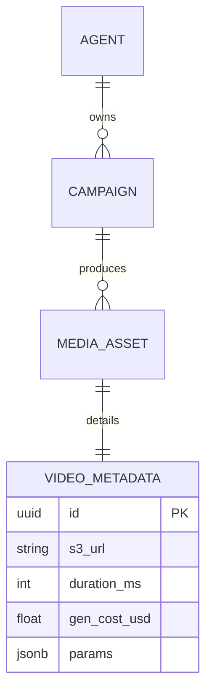

# Technical Contracts & Schemas

## Task Payload (Planner → Redis → Worker)
```json
{
  "task_id": "uuidv7-string",
  "agent_id": "uuid",
  "campaign_id": "uuid",
  "task_type": "perceive_trends | generate_text | generate_image | publish | transfer_usdc | ...",
  "priority": "high|medium|low",
  "created_at": "2026-02-05T15:49:00Z",
  "input": { ... },
  "required_mcp_resources": ["twitter://mentions", "news://ethiopia/fashion"],
  "allowed_mcp_tools": ["ideogram_generate", "twitter_post"]
}
```

## Judge Output
```json
{
  "task_id": "...",
  "decision": "approve | reject | escalate",
  "confidence": 0.87,
  "reason": "Image matches character reference; caption on-brand",
  "escalation_category": null
}
```

## Persistence Overview
- PostgreSQL: agents, campaigns, tasks, hitl_queue
- Weaviate: AgentMemories collection (vectors + metadata)
- Redis: task_queue, review_queue, short-term context, daily_spend counters

## Simple Mermaid ERD (video/media assets)

