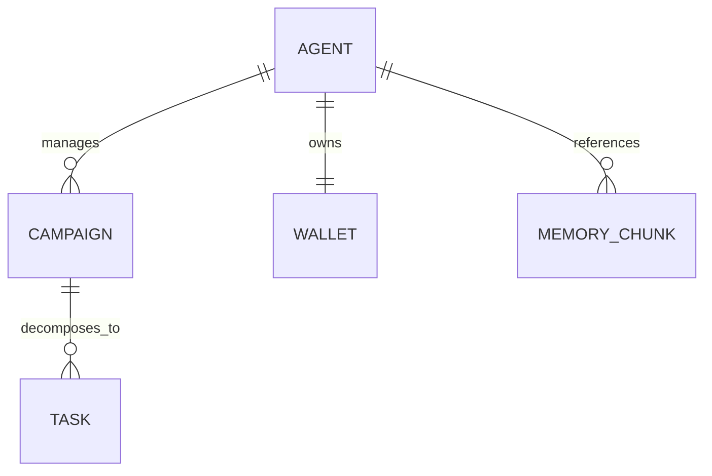

# Technical Specification

## Purpose
Define contracts, schemas, and persistence models for Chimera’s core systems. This document is the authoritative source for API shapes and data models.

## API / Task Contracts
### Task JSON Schema (Planner → Worker)
```json
{
  "task_id": "string (UUID)",
  "task_type": "enum: generate_caption | reply_comment | fetch_trends | execute_transfer",
  "priority": "high | medium | low",
  "context": {
    "goal_id": "string",
    "persona_id": "string",
    "locale": "string",
    "inputs": {}
  },
  "required_resources": ["mcp://twitter/mentions", "mcp://news/ethiopia/fashion"],
  "created_at": "ISO-8601 timestamp"
}
```

### MCP Tool Example
```
post_content: { platform, text_content, media_urls, disclosure_level }
```

## Database Schema (High-Level ERD)
### Entities
- **Agents (PostgreSQL):** id, tenant_id, persona_id, wallet_address
- **Campaigns:** id, agent_id, goal_description, status, budget_usdc
- **Tasks:** id, campaign_id, task_type, status, result_json
- **Memories (Weaviate):** vectorized chunks with metadata (timestamp, relevance, source)
- **Financial Ledger:** on-chain (Base/Ethereum) + PostgreSQL mirror for queries

### Mermaid ERD


## Constraints
- All data contracts must be versioned and backward-compatible.
- Multi-tenant isolation enforced at the schema and access layers.
- Wallet-related data must be encrypted at rest and in transit.

## Acceptance Criteria
- All services validate task payloads against the Task JSON Schema.
- ERD coverage includes at least Agents, Campaigns, Tasks, Memory, Wallet.
- MCP tool interfaces are defined before implementation.
